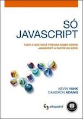
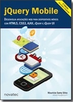

A disciplina de [Linguagem de Script](docs/plano-de-ensino.pdf) (LS) do Curso Superior de Tecnologia em Sistemas para Internet do IFPB tem como objetivo apresentar ao aluno conceitos sobre linguagens de script para processamentos de front-end. Sua carga horária apresenta um total de 67 horas aula e será ministrada pelos professores Alana Morais e Luiz Carlos Chaves. Para as aulas serão utilizadas exposições e atividades práticas, além de avaliações individuais e em grupo.

> Esta discipilna possui como pré-requisito necessário o conhecimento prévio de Algoritmos, HTML e CSS.

## Conteúdo

A disciplina apresenta o seguinte [conteúdo](docs/CONTENT.md) que será dividido conforme este [roteiro de aula](docs/OUTLINE.md) e este [Google Classroom](https://classroom.google.com/u/1/c/NjE3NTcxMjYwMjda).

## Horário e ambiente

As aulas da disciplina serão alocados nesses horários e ambientes:

| Dia     | Horário     | Ambiente                            |
| ------- | ----------- | ----------------------------------- |
| Segunda | 13:00-14:40 | Laboratório 01 e Redes Convergentes |
| Quarta  | 14:40-16:20 | Laboratório 01 e SI                 |

## Avaliações

A nota final será computada através da média ponderada das três maiores avaliações:

- Avaliação I: [Prova ECMA](exams/prova-ecma.md);
- Avaliação II: [Prova W3C](exams/prova-w3c.md);
- Avaliação III: [Blog](exams/blog.md);
- Avaliação IV (Projeto): [especificação](exams/projeto.md).

Detalhe, a nota do projeto não poderá ser eliminada e atividades extras podem gerar pontuação extra.

## Comunicação

Toda a comunicação será realizada usando o [telegram da disciplina](https://t.me/ifpbls20201).

## Bibliografia

### Bibliografia Básica

  

### Bibliografia Complementar

    
  

 <!-- https://www.livrariacultura.com.br/p/livros/informatica-e-tecnologia/programacao/javascript-avancado-3116907 -->

E para completar ainda mais a listagem existe estes [exemplares](http://jsbooks.revolunet.com/) como outros indicações.
