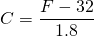
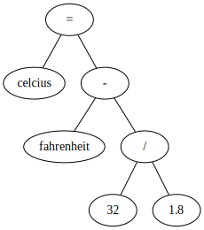
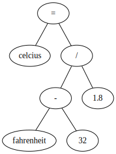

# Introdução ao JavaScript ECMA

  - [Introdução](#introdução)
  - [Execução de Código](#execução-de-código)
    - [Instalação](#instalação)
    - [Execução](#execução)
  - [Tipos de dados](#tipos-de-dados)
  - [Declaração de variáveis](#declaração-de-variáveis)
    - [Reassociação](#reassociação)
    - [Escopo](#escopo)
    - [Tipagem Dinâmica](#tipagem-dinâmica)
    - [Tipagem Fraca](#tipagem-fraca)
    - [Case Sensitive](#case-sensitive)
  - [Expressões e operadores](#expressões-e-operadores)
    - [Expression](#expression)
    - [Operators List](#operators-list)

## Introdução

---

- Criada por Brendan Eich em 1995 (Netscape)
- Ecossistema popular ([Stackoverflow](https://insights.stackoverflow.com/survey/2020#technology-programming-scripting-and-markup-languages))
  - [ECMAScript 262 11ᵗʰ, 2020](https://www.ecma-international.org/ecma-262/) ([tc39](https://github.com/tc39/ecma262)): expressions, statements, declarations, functions
  - [W3C TR](https://www.w3.org/TR/): [Web API](https://developer.mozilla.org/en-US/docs/Web/API), [DOM](https://developer.mozilla.org/en-US/docs/Web/API/Document_Object_Model)
  - [NPM](https://www.npmjs.com/): React, Angular, Express
- Características
  - Linguagem de alto nível
  - Linguagem interpretada
  - Linguagem de script
  - Tipagem dinâmica e fraca
  - Automatic semicolon insertion (ASI)
  - Multi-paradigma: orientado a eventos, orientado a objeto, protótipos, imperativo, funcional

## Execução de Código

---

### Instalação

- Navegador
- Node.js
  - [Download Binary](https://nodejs.org/en/download/)
  - [Installing Node.js via package manager](https://nodejs.org/en/download/package-manager/)
    - [Debian (snap)](https://nodejs.org/en/download/package-manager/#debian-and-ubuntu-based-linux-distributions-enterprise-linux-fedora-and-snap-packages)
    - [Windows (chocolatey)](https://nodejs.org/en/download/package-manager/#windows)
    - [nvm](https://nodejs.org/en/download/package-manager/#nvm)

Testar a instalação:

```
$ node -v
$ npm -v
$ npx -v
```

### Execução

- Terminal (`node file.js`)
- Ambiente de Desenvolvimento
  - Desktop: VSCode
  - Online: [codesandbox](https://codesandbox.io/)
- Navegador

## [Tipos de dados](https://ifpb.github.io/javascript-guide/ecma/values-and-types/)

---

<br>
[JavaScript for impatient programmers (Book)](http://exploringjs.com/impatient-js/ch_values.html)

| Category  | Types                           | Values                                                                      |
| --------- | ------------------------------- | --------------------------------------------------------------------------- |
| Primitive | [Undefined](../undefined/syntax.md) | `undefined`                                                                                       |
| Primitive | [Null](../null/syntax.md)           | `null`                                                                                            |
| Primitive | [Boolean](../boolean/syntax.md)     | `true`, `false`                                                                                   |
| Primitive | [Number](../number/syntax.md)       | `-15`<br>`15`, `0b1111`, `0o17`, `0xf`<br>`-123.45`<br>`123.45`, `1.2345e2`, `12345E-2` |
| Primitive | [String](../string/syntax.md)       | `'Hello'`, `"Hello"`, `` `Hello` ``                                                               |
| Object    | [Array](../array/syntax.md)         | `[]`<br>`[1, 2, 3]`<br>`[1, '2', true, [3, false]]`<br>`["Alice", "alice@email"]`                                                           |
| Object    | [Object](../object/syntax.md)       | `{name: "Alice", email: "alice@email"}`                                                            |

## [Declaração de variáveis](https://ifpb.github.io/javascript-guide/ecma/variable/)

---

Linguagem C:
```c
int number = 10;
```

Linguagem Python:
```py
number = 10
```

Keyword
```js
var number = 10;
console.log(number); //=> 10
```

```js
let number = 10;
console.log(number); //=> 10
```

```js
const number = 10;
console.log(number); //=> 10
```

### Reassociação

```js
var number;
number = 10;
number = 100;
console.log(number); //=> 100
```

```js
let number;
number = 10;
number = 100;
console.log(number); //=> 100
```

```js
const number; // SyntaxError
const number = 10;
number = 100; // TypeError
```

```js
const numbers = [];
numbers.push(1);
console.log(numbers); //=> [ 1 ]
```

### Escopo

```js
var number = 10;
var number = 10;
```

```js
let number = 10;
let number = 10; // SyntaxError: Identifier 'number' has already been declared
```

```js
const number = 10;
const number = 10; // SyntaxError: Identifier 'number' has already been declared
```

### Tipagem Dinâmica

```js
let variable = 10;
console.log(variable); //=> 10
console.log(typeof variable); //=> number

variable = 'fulano';
console.log(variable); //=> 'fulano'
console.log(typeof variable); //=> string
```

### Tipagem Fraca

```js
const x = 10;
const y = '5';
console.log(x - y); //=> 5
```

### Case Sensitive

```js
const number = 8;
const Number = 80;
const NUMBER = 800;
```

## [Expressões e operadores](https://ifpb.github.io/javascript-guide/ecma/expression-and-operator/)

---

### Expression

<!--
\begin{align*}
C = \frac{F - 32}{1.8}
\end{align*}
 -->



Option 1:
```js
const fahrenheit = 50;
const celsius = fahrenheit - 32 / 1.8;
console.log(celsius); //=> 32.2
```



Option 2 (grouping operator):
```js
const fahrenheit = 50;
const celsius = (fahrenheit - 32) / 1.8;
console.log(celsisu); //=> 10
```



References:

- [Operator precedence](https://developer.mozilla.org/en-US/docs/Web/JavaScript/Reference/Operators/Operator_Precedence)

### [Operators List](https://ifpb.github.io/javascript-guide/ecma/expression-and-operator/)

| Operator type              | Operators                                                                                                             |
| -------------------------- | --------------------------------------------------------------------------------------------------------------------- |
| Primary expressions        | `this`, `function`, `class`, `function*`, `yield`, `yield*`, `async function*`, `await`, `[]`, `{}`, `/ab+c/i`, `( )` |
| Left-hand-side expressions | `object.property`, `object["property"]`, `new`, `new.target`, `super`, `...obj`                                       |
| Increment and decrement    | `A++`, `A--`, `++A`, `--A`                                                                                            |
| Unary operators            | `delete`, `void`, `typeof`, `+`, `-`, `~`, `!`                                                                        |
| Arithmetic operators       | `+`, `-`, `*`, `/`, `%`, `**`                                                                                         |
| Relational operators       | `in`, `instanceof`, `<`, `<=`, `>`, `>=`                                                                              |
| Equality operators         | `==`, `!=`, `===`, `!==`                                                                                              |
| Bitwise shift operators    | `<<`, `>>`, `>>>`                                                                                                     |
| Binary bitwise operators   | `&`, `|`, `^`                                                                                                         |
| Binary logical operators   | `&&`, `||`                                                                                                            |
| Assignment operators       | `=`, `*=`, `/=`, `%=`, `+=`, `-=`, `<<=`, `>>=`, `>>>=`, `&=`, `^=`, `|=`, `[a, b] = [1, 2]`, `{a, b} = {a:1, b:2}`   |
| Conditional operator       | `(condition ? ifTrue : ifFalse)`                                                                                      |
| Comma operator             | `,`                                                                                                                   |

Referências:
- [Expressions and operators \| MDN](https://developer.mozilla.org/en-US/docs/Web/JavaScript/Reference/Operators/Operator_Precedence)
