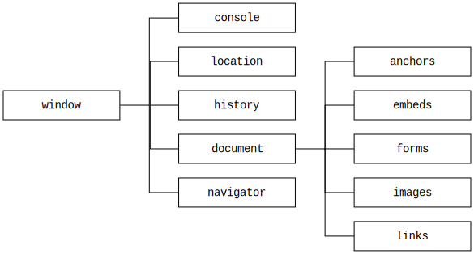
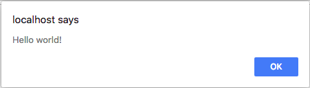
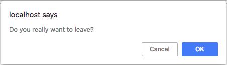
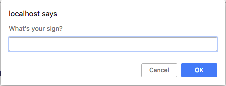
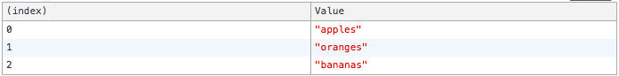

# Objetos do Navegador

  - [Integrando JS e HTML](#integrando-js-e-html)
  - [Web APIs](#web-apis)
  - [Window](#window)
    - [Window Features](#window-features)
    - [Window Hierarchy](#window-hierarchy)
    - [Window.innerHeight & Window.innerWidth](#windowinnerheight--windowinnerwidth)
    - [Window.alert()](#windowalert)
    - [Window.confirm()](#windowconfirm)
    - [Window.prompt()](#windowprompt)
    - [Window.close()](#windowclose)
    - [Window.open()](#windowopen)
    - [Window.print()](#windowprint)
  - [Location](#location)
    - [Location.href](#locationhref)
    - [Location.assign()](#locationassign)
    - [Location.reload()](#locationreload)
  - [History](#history)
    - [History.back()](#historyback)
    - [History.forward()](#historyforward)
    - [History.go()](#historygo)
  - [Console](#console)
    - [Console.clear()](#consoleclear)
    - [Console.log()](#consolelog)
    - [Console.table()](#consoletable)
  - [Document](#document)
    - [Document.body](#documentbody)
    - [Document.title](#documenttitle)
    - [Document.getElementById()](#documentgetelementbyid)
    - [Document.querySelector()](#documentqueryselector)
    - [Document.querySelectorAll()](#documentqueryselectorall)
    - [Document.write()](#documentwrite)

## Integrando JS e HTML

---

[hello-js/index.html](codes/hello-js/index.html):

```html

```

[hello-js/js/index.js](codes/hello-js/js/index.js):

```js

```

## Web APIs

---

- Standards
  - [W3C](https://www.w3.org/)
    - [Work Groups](https://www.w3.org/groups/wg/)
      - [CSS Working Group](https://www.w3.org/groups/wg/css)
      - [HTML Working Group](https://www.w3.org/groups/wg/htmlwg)
      - [Web Payments Working Group](https://www.w3.org/groups/wg/payments)
    - [Standards](https://www.w3.org/standards/)
      - [Web Design and Applications](https://www.w3.org/standards/webdesign/)
        - [JavaScript Web APIs](https://www.w3.org/TR/?tag=webapi)
  - [WHATWG](https://whatwg.org/)
    - [Standards](https://spec.whatwg.org/)
- [Web APIs (MDN)](https://developer.mozilla.org/en-US/docs/Web/API):
  - [DOM](https://developer.mozilla.org/en-US/docs/Web/API/Document_Object_Model)
  - [Fetch API](https://developer.mozilla.org/en-US/docs/Web/API/Fetch_API)
  - [Geolocation API](https://developer.mozilla.org/en-US/docs/Web/API/Geolocation_API)
  - [Storage API](https://developer.mozilla.org/en-US/docs/Web/API/Storage_API)
  - [Web Notifications](https://developer.mozilla.org/en-US/docs/Web/API/Notifications_API)
  - [WebRTC API](https://developer.mozilla.org/en-US/docs/Web/API/WebRTC_API)
  - [Websockets API](https://developer.mozilla.org/en-US/docs/Web/API/WebSockets_API)

## [Window](https://developer.mozilla.org/en-US/docs/Web/API/Window)

---

### Window Features

<br>
Reference: [MDN](https://developer.mozilla.org/en-US/docs/Web/API/Window/open)

### Window Hierarchy



### [Window.innerHeight](https://developer.mozilla.org/en-US/docs/Web/API/Window/innerHeight) & [Window.innerWidth](https://developer.mozilla.org/en-US/docs/Web/API/Window/innerWidth)

```js
const width = window.innerWidth
const height = window.innerHeight
console.log(width, height)
```

### [Window.alert()](https://developer.mozilla.org/en-US/docs/Web/API/Window/alert)


```js
window.alert("Hello world!")
```

Ouput:



### [Window.confirm()](https://developer.mozilla.org/en-US/docs/Web/API/Window/confirm)

```js
const close = window.confirm("Do you really want to leave?")
console.log(close)
```

Ouput:



### [Window.prompt()](https://developer.mozilla.org/en-US/docs/Web/API/Window/prompt)

```js
const sign = prompt("What's your sign?")
console.log(sign)
```

Ouput:



### [Window.close()](https://developer.mozilla.org/en-US/docs/Web/API/Window/close)

```js
window.close()
```

### [Window.open()](https://developer.mozilla.org/en-US/docs/Web/API/Window/open)

```js
const windowRef = window.open('http://www.ifpb.edu.br')
```

### [Window.print()](https://developer.mozilla.org/en-US/docs/Web/API/Window/print)

```js
window.print()
```

## [Location](https://developer.mozilla.org/en-US/docs/Web/API/Location)

---

### [Location.href](https://developer.mozilla.org/en-US/docs/Web/API/Location/href)

```js
location.href = 'http://www.ifpb.edu.br/noticias'
```

### [Location.assign()](https://developer.mozilla.org/en-US/docs/Web/API/Location/assign)

```js
location.assign('http://www.ifpb.edu.br/')
```

### [Location.reload()](https://developer.mozilla.org/en-US/docs/Web/API/Location/reload)

```js
location.reload()
```

## [History](https://developer.mozilla.org/en-US/docs/Web/API/History)

---

### [History.back()](https://developer.mozilla.org/en-US/docs/Web/API/History)

```js
history.back()    // history.go(-1)
```

### [History.forward()](https://developer.mozilla.org/en-US/docs/Web/API/History)

```js
history.forward() // history.go(1)
```

### [History.go()](https://developer.mozilla.org/en-US/docs/Web/API/History)

```js
history.go(-1)
history.go(1)
```

## [Console](https://developer.mozilla.org/en-US/docs/Web/API/Console)

---

### [Console.clear()](https://developer.mozilla.org/en-US/docs/Web/API/Console/clear)

```js
console.clear()
```

### [Console.log()](https://developer.mozilla.org/en-US/docs/Web/API/Console/log)

```js
const name = 'Alice'
console.log(name)
```

```
Alice
> undefined
```

### [Console.table()](https://developer.mozilla.org/en-US/docs/Web/API/Console/table)

```js
const fruits = ["apples", "oranges", "bananas"]
console.table(fruits)
```




## [Document](https://developer.mozilla.org/en-US/docs/Web/API/Document)

---

### [Document.body](https://developer.mozilla.org/en-US/docs/Web/API/Document/body)

```js
const body = document.body
console.log(body)
```

### [Document.title](https://developer.mozilla.org/en-US/docs/Web/API/Document/title)

```js
console.log(document.title)
```

### [Document.getElementById()](https://developer.mozilla.org/en-US/docs/Web/API/Document/getElementById)

```js
const passwordElement = document.getElementById('password')
console.log(passwordElement.value)
```

### [Document.querySelector()](https://developer.mozilla.org/en-US/docs/Web/API/Document/querySelector)

```js
const passwordElement = document.querySelector('#password')
console.log(passwordElement.value)
```

### [Document.querySelectorAll()](https://developer.mozilla.org/en-US/docs/Web/API/Document/querySelectorAll)

```js
const inputs = document.querySelector('input')
Array.from(inputs).map(i => i.value)
```

### [Document.write()](https://developer.mozilla.org/en-US/docs/Web/API/Document/write)

```js
document.write('<h1>Lorem ipsum</h1>')
```
