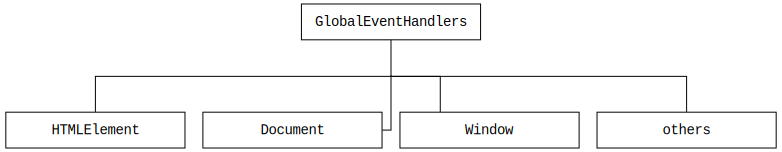
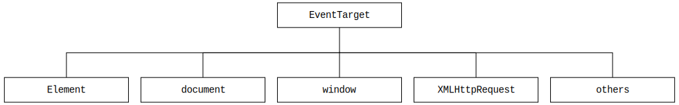

#  Manipulação do DOM e Eventos no JavaScript

  - [Árvore DOM](#árvore-dom)
  - [Element](#element)
    - [Element.innerHTML](#elementinnerhtml)
    - [Element.innerText](#elementinnertext)
    - [Element.classList](#elementclasslist)
    - [Element.className](#elementclassname)
    - [Element.setAttribute()](#elementsetattribute)
  - [HTMLElement](#htmlelement)
    - [HTMLElement.style](#htmlelementstyle)
  - [HTMLInputElement](#htmlinputelement)
    - [HTMLInputElement.value](#htmlinputelementvalue)
    - [HTMLInputElement.checked](#htmlinputelementchecked)
  - [GlobalEventHandlers](#globaleventhandlers)
    - [Hierarchy](#hierarchy)
    - [Registering on-event handlers](#registering-on-event-handlers)
    - [On-event handlers](#on-event-handlers)
  - [EventTarget](#eventtarget)
    - [EventTarget.addEventListener()](#eventtargetaddeventlistener)

## Árvore DOM


Fonte: [Google Developers - Constructing the Object Model](https://developers.google.com/web/fundamentals/performance/critical-rendering-path/constructing-the-object-model)

## [Element](https://developer.mozilla.org/en-US/docs/Web/API/Element)

---

### [Element.innerHTML](https://developer.mozilla.org/en-US/docs/Web/API/Element/innerHTML)

```js
document.body.innerHTML = '<h1>Lorem ipsum</h1>'
```

### [Element.innerText](https://developer.mozilla.org/en-US/docs/Web/API/Element/innerText)

```js
const p = document.querySelector('p')
p.innerText = 'Lorem ipsum'
```

### [Element.classList](https://developer.mozilla.org/en-US/docs/Web/API/Element/classList)

```js
document.body.classList.remove('color-red')
document.body.classList.add('color-blue')
```

### [Element.className](https://developer.mozilla.org/en-US/docs/Web/API/Element/className)

```js
document.body.className = 'text-center'
```

### [Element.setAttribute()](https://developer.mozilla.org/en-US/docs/Web/API/Element/setAttribute)

```js
document.body.setAttribute('class', 'active red')
```

## [HTMLElement](https://developer.mozilla.org/en-US/docs/Web/API/HTMLElement)

---

### [HTMLElement.style](https://developer.mozilla.org/en-US/docs/Web/API/HTMLElement/style)

[CSSStyleDeclaration](https://developer.mozilla.org/en-US/docs/Web/API/CSSStyleDeclaration):

```js
const p = document.querySelector('p')
p.style.cssText = "color: blue;"
```

[CSSStyleDeclaration.cssText](https://developer.mozilla.org/en-US/docs/Web/API/CSSStyleDeclaration/cssText):

```js
const p = document.querySelector('p')
p.style.cssText = "color: blue; font-size: 1.1rem;"
```

[CSS Properties](https://developer.mozilla.org/en-US/docs/Web/CSS/CSS_Properties_Reference):

```js
const p = document.querySelector('p')
p.style.fontSize = "1.1rem"
```

[Element.setAttribute()](https://developer.mozilla.org/en-US/docs/Web/API/Element/setAttribute) (Alternative):

```js
const p = document.querySelector('p')
p.setAttribute("style", "color: blue; font-size: 1.1rem;")
```

```js
const p = document.querySelector('p')
p.setAttribute("class", "active red")
```

[Element.classList](https://developer.mozilla.org/en-US/docs/Web/API/Element/classList) (Alternative):

```js
const p = document.querySelector('p')
p.classList.add('color-blue')
```

[Element.className](https://developer.mozilla.org/en-US/docs/Web/API/Element/className) (Alternative):

```js
const p = document.querySelector('p')
p.className = 'text-center'
```

## [HTMLInputElement](https://developer.mozilla.org/en-US/docs/Web/API/HTMLInputElement)

---

### [HTMLInputElement.value](https://developer.mozilla.org/en-US/docs/Web/API/HTMLInputElement)

```js
const input = document.querySelector('#name')
console.log(input.value)

input.value = 'Alice'
console.log(input.value)
```

### [HTMLInputElement.checked](https://developer.mozilla.org/en-US/docs/Web/API/HTMLInputElement)

```js
const input = document.querySelector('#male')
input.checked
```

## [GlobalEventHandlers](https://developer.mozilla.org/en-US/docs/Web/API/GlobalEventHandlers)

---

### Hierarchy



### Registering on-event handlers

HTML attribute named on{eventtype}:
```html
<!DOCTYPE html>
<html lang="en">
<head>
  <meta charset="UTF-8">
  <meta name="viewport" content="width=device-width, initial-scale=1.0">
  <meta http-equiv="X-UA-Compatible" content="ie=edge">
  <title>Document</title>
</head>
<body>
  <h1>Lorem ipsum</h1>
  <button onclick="window.print()">Print</button>
</body>
</html>
```

Setting the on-event handlers property from JavaScript:
```html
<!DOCTYPE html>
<html lang="en">
<head>
  <meta charset="UTF-8">
  <meta name="viewport" content="width=device-width, initial-scale=1.0">
  <meta http-equiv="X-UA-Compatible" content="ie=edge">
  <title>Document</title>
</head>
<body>
  <h1>Lorem ipsum</h1>
  <button>Print</button>
</body>
</html>
```

```js
const button = document.querySelector('button')
button.onclick = function() {
  window.print()
}
```

### On-event handlers

* onclick
* onkeyup
* onload
* onchange

## [EventTarget](https://developer.mozilla.org/en-US/docs/Web/API/EventTarget)

---



### [EventTarget.addEventListener()](https://developer.mozilla.org/en-US/docs/Web/API/EventTarget/addEventListener)

Click ([MouseEvent](https://developer.mozilla.org/en-US/docs/Web/API/MouseEvent)):
```js
const button = document.querySelector('button#print')

button.addEventListener('click', function() {
  window.print()
})
```

Keyup ([KeyboardEvent](https://developer.mozilla.org/en-US/docs/Web/API/KeyboardEvent), [Key Values](https://developer.mozilla.org/en-US/docs/Web/API/KeyboardEvent/key/Key_Values)):
```js
document.addEventListener('keyup', function(event) {
  if (event.key == 'Enter') {
    console.log('Enter key')
  }
})
```
