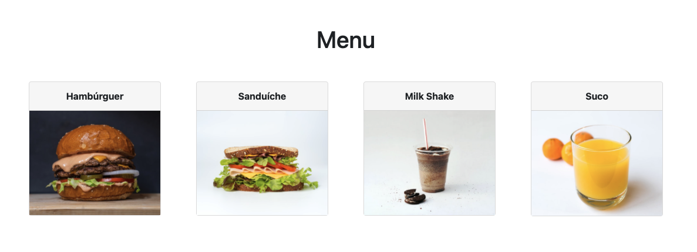

# Criando Elementos Dinâmicos

  - [Element](#element)
    - [Element.innerHTML](#elementinnerhtml)
    - [Element.insertAdjacentHTML()](#elementinsertadjacenthtml)
  - [Document](#document)
  - [Foods App](#foods-app)

## [Element](https://developer.mozilla.org/en-US/docs/Web/API/Element)

---

### [Element.innerHTML](https://developer.mozilla.org/en-US/docs/Web/API/Element/innerHTML)

```js
const body = document.body;
body.innerHTML = '<h1>Lorem ipsum</h1>'
```

### [Element.insertAdjacentHTML()](https://developer.mozilla.org/en-US/docs/Web/API/Element/insertAdjacentHTML)

```js
const body = document.body;
body.insertAdjacentHTML('afterbegin', '<h1>Lorem ipsum</h1>')
```

```html
<!-- beforebegin -->
<body>
  <!-- afterbegin -->
  ...
  <!-- beforeend -->
</body>
<!-- afterend -->
```

Referências:
  - [Document.createElement](https://developer.mozilla.org/en-US/docs/Web/API/Document/createElement)
  - [Document.creaTextNode](https://developer.mozilla.org/en-US/docs/Web/API/Document/creaTextNode)
  - [Node.insertBefore](https://developer.mozilla.org/en-US/docs/Web/API/Node/insertBefore)
  - [Node.appendChild](https://developer.mozilla.org/en-US/docs/Web/API/Node/appendChild)

## [Document](https://developer.mozilla.org/en-US/docs/Web/API/Document)

---

```js
const h1 = document.createElement("h1");
const text = document.createTextNode("Lorem ipsum");
h1.appendChild(text);

const body = document.body;
body.appendChild(h1);
```

## Foods App

---

[](https://foods-read.lucachaves.repl.co/)

[Edit on Repl.it](https://replit.com/@lucachaves/foods-read?v=1)

Estrutura de Código:

```
foods-read
├── css
│   ├── bootstrap.min.css
│   └── style.css
├── imgs
│   ├── batatafrita.jpg
│   ├── hamburguer.jpg
│   ├── milkshake.jpg
│   ├── sanduiche.jpg
│   └── suco.jpg
├── index.html
└── js
    ├── lib
    │   ├── bootstrap.min.js
    │   ├── jquery.min.js
    │   └── popper.min.js
    ├── main.js
    └── model
        └── dataset.js
```

foods-read/index.html:
```html
<body>
  <div class="container">
    <h1 class="mt-5 text-center">Menu</h1>

    <section class="card-deck my-3"></section>
  <div>
  <script src="js/lib/jquery.min.js"></script>
  <script src="js/lib/popper.min.js"></script>
  <script src="js/lib/bootstrap.min.js"></script>
  <script src="js/main.js" type="module"></script>
</body>
```

foods-read/js/model/dataset.js:
```js

```

foods-read/js/main.js:
```js

```

