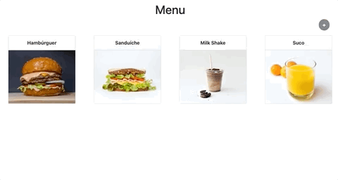
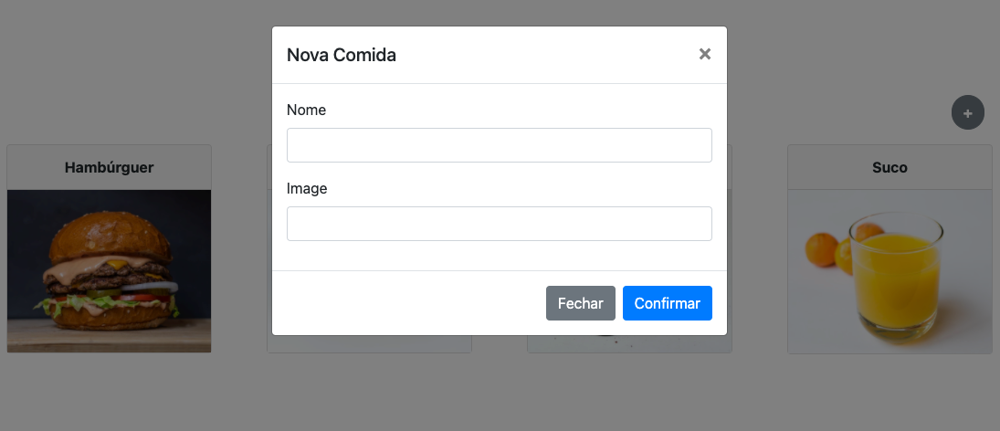

# Criando Elementos Dinâmicos

  - [Foods App](#foods-app)
  - [Estrutura do Código](#estrutura-do-código)
  - [Camada de Dados](#camada-de-dados)
  - [Dados Novos](#dados-novos)

## Foods App

---

[](https://foods-create.lucachaves.repl.co/)

[Edit on Repl.it](https://replit.com/@lucachaves/foods-create?v=1)

## Estrutura do Código

---

```
foods-create
├── css
│   ├── bootstrap.min.css
│   └── style.css
├── imgs
│   ├── batatafrita.jpg
│   ├── hamburguer.jpg
│   ├── milkshake.jpg
│   ├── sanduiche.jpg
│   └── suco.jpg
├── index.html
└── js
    ├── lib
    │   ├── bootstrap.min.js
    │   ├── jquery.min.js
    │   └── popper.min.js
    ├── main.js
    └── model
        ├── dataset.js
        └── foods.js
```

foods-create/index.html:
```html
<body>
  <div class="container">
    <h1 class="mt-5 text-center">Menu</h1>

    <div class="text-right">
      <button
        type="button"
        class="btn btn-secondary rounded-circle mr-4 font-weight-bold"
        id="newBtnFood"
        data-toggle="modal"
        data-target="#formFoodModal"
        onclick="loadFormCreateFood()">
        +
      </button>
    </div>

    <section class="card-deck my-3"></section>

    <form id="formFood">
      ...
    </form>
  <div>
  <script src="js/lib/jquery.min.js"></script>
  <script src="js/lib/popper.min.js"></script>
  <script src="js/lib/bootstrap.min.js"></script>
  <script src="js/main.js" type="module"></script>
</body>
```

## Camada de Dados

---

foods-create/js/model/dataset.js:
```js
const dataset = [
  {
    id: 1,
    name: 'Hambúrguer',
    image: 'imgs/hamburguer.jpg',
  },
  {
    id: 2,
    name: 'Sanduíche',
    image: 'imgs/sanduiche.jpg',
  },
  {
    id: 3,
    name: 'Milk Shake',
    image: 'imgs/milkshake.jpg',
  },
  {
    id: 4,
    name: 'Suco',
    image: 'imgs/suco.jpg',
  },
];

export default dataset;
```

foods-create/js/model/food.js:
```js
function nextId() {
  const foods = readAll();

  const ids = foods.map((food) => food.id);

  const maxId = Math.max(...ids);

  return maxId + 1;
}

function load(newFoods) {
  localStorage.setItem('foods', JSON.stringify(newFoods));
}

function create(food) {
  food = { id: nextId(), ...food };

  const foods = readAll();

  const newFoods = [...foods, food];

  load(newFoods);

  return food;
}

function readAll() {
  return JSON.parse(localStorage.getItem('foods'));
}

function read(id) {
  const foods = readAll();

  const food = foods.find((food) => food.id === id);

  return food;
}

function update(id, food) {
  const foods = readAll();

  const index = foods.findIndex((food) => food.id === id);

  if (index >= 0) {
    foods[index] = { id, ...food };
  }

  load(foods);

  return food;
}

function destroy(id) {
  const foods = readAll();

  const index = foods.findIndex((food) => food.id === id);

  if (index >= 0) {
    foods.splice(index, 1);
  }

  load(foods);
}

export default { load, create, readAll, read, update, destroy };
```

## Dados Novos

---



foods-create/index.html:
```html
<form id="formFood">
  <div class="modal fade" id="formFoodModal" tabindex="-1" aria-labelledby="formFoodLabel" aria-hidden="true">
    <div class="modal-dialog">
      <div class="modal-content">
        <div class="modal-header">
          <h5 class="modal-title" id="formFoodLabel"></h5>
          <button type="button" class="close" data-dismiss="modal" aria-label="Close">
            <span aria-hidden="true">&times;</span>
          </button>
        </div>
        <div class="modal-body">
          <div class="form-group">
            <label for="food-name">Nome</label>
            <input type="text" class="form-control" id="food-name" name="name">
          </div>
          <div class="form-group">
            <label for="food-image">Image</label>
            <input type="text" class="form-control" id="food-image" name="image">
          </div>
        </div>
        <div class="modal-footer">
          <button type="button" class="btn btn-secondary" data-dismiss="modal">Fechar</button>
          <button type="submit" class="btn btn-primary">Confirmar</button>
        </div>
      </div>
    </div>
  </div>
</form>
```

foods-create/js/main.js:
```js
import dataset from './model/dataset.js';
import foods from './model/foods.js';

function loadFoods() {
  foods.load(dataset);

  for (const food of foods.readAll()) {
    createFoodView(food);
  }
}

function createFoodView(food) {
  const foodsView = `
        <div class="card-food col-sm-6 col-lg-4 col-xl-3 mb-3" id="food-${food.id}">
          ...
        </div>
      `;

  const foodsDeck = document.querySelector('.card-deck');

  foodsDeck.insertAdjacentHTML('beforeend', foodsView);
}

function loadFormValues(title, foodName, foodImage) {
  const formLabel = document.querySelector('#formFoodLabel');
  const foodNameInput = document.querySelector('#food-name');
  const foodImageInput = document.querySelector('#food-image');

  formLabel.innerHTML = title;
  foodNameInput.value = foodName;
  foodImageInput.value = foodImage;
}

function loadFormCreateFood() {
  const formFood = document.querySelector('#formFood');

  loadFormValues('Nova Comida', '', '');

  formFood.onsubmit = (e) => {
    e.preventDefault();

    let food = Object.fromEntries(new FormData(formFood));

    const newFood = foods.create(food);

    createFoodView(newFood);

    $('#formFoodModal').modal('toggle');

    document.querySelector('#newBtnFood').blur();
  };
}

window.loadFormCreateFood = loadFormCreateFood;

loadFoods();
```
