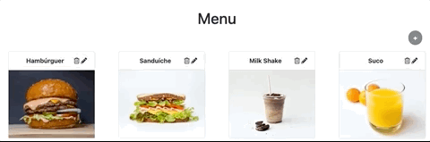
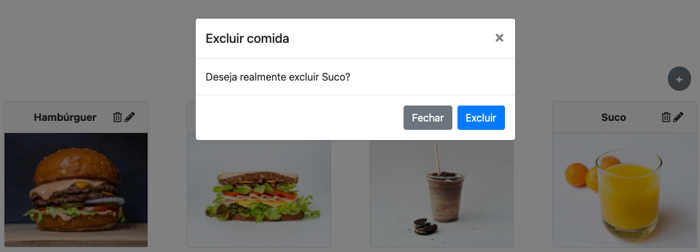
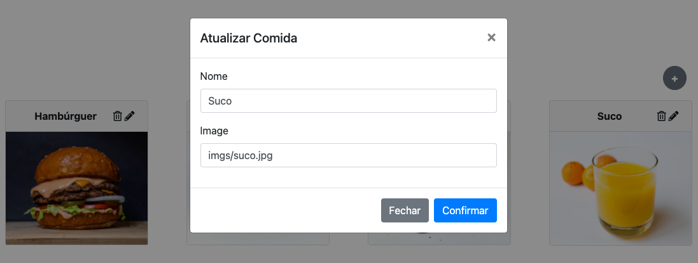

# Criando Elementos Dinâmicos

  - [Foods App](#foods-app)
  - [Estrutura do Código](#estrutura-do-código)
  - [Camada de Dados](#camada-de-dados)
  - [Excluir Dados](#excluir-dados)
  - [Atualizar Dados](#atualizar-dados)

## Foods App

---

[](https://foods-crud.lucachaves.repl.co/)

[Edit on Repl.it](https://replit.com/@lucachaves/foods-crud?v=1)

## Estrutura do Código

---

```
foods-crud
├── css
│   ├── bootstrap.min.css
│   └── style.css
├── imgs
│   ├── batatafrita.jpg
│   ├── hamburguer.jpg
│   ├── milkshake.jpg
│   ├── sanduiche.jpg
│   └── suco.jpg
├── index.html
└── js
    ├── lib
    │   ├── bootstrap.min.js
    │   ├── jquery.min.js
    │   └── popper.min.js
    ├── main.js
    └── model
        ├── dataset.js
        └── foods.js
```

foods-crud/index.html:
```html
<body>
  <div class="container">
    <h1 class="mt-5 text-center">Menu</h1>

    <div class="text-right">
      <button
        type="button"
        class="btn btn-secondary rounded-circle mr-4 font-weight-bold"
        id="newBtnFood"
        data-toggle="modal"
        data-target="#formFoodModal"
        onclick="loadFormCreateFood()">
        +
      </button>
    </div>

    <section class="card-deck my-3"></section>

    <form id="formFood">
      ...
    </form>

    <form id="formDeleteFood">
      ...
    </form>
  <div>
  <script src="js/lib/jquery.min.js"></script>
  <script src="js/lib/popper.min.js"></script>
  <script src="js/lib/bootstrap.min.js"></script>
  <script src="js/main.js" type="module"></script>
</body>
```

## Camada de Dados

---

foods-crud/js/model/dataset.js:
```js

```

foods-crud/js/model/food.js:
```js
...

export default { load, create, readAll, read, update, destroy };
```

## Excluir Dados

---



foods-crud/index.html:
```html
<form id="formDeleteFood">
  <div class="modal fade" id="deleteFoodModal" tabindex="-1" aria-labelledby="deleteFoodLabel" aria-hidden="true">
    <div class="modal-dialog">
      <div class="modal-content">
        <div class="modal-header">
          <h5 class="modal-title" id="deleteFoodLabel">Excluir comida</h5>
          <button type="button" class="close" data-dismiss="modal" aria-label="Close">
            <span aria-hidden="true">&times;</span>
          </button>
        </div>
        <div class="modal-body">
          Deseja realmente excluir <span id="modal-name-food"></span>?
        </div>
        <div class="modal-footer">
          <button type="button" class="btn btn-secondary" data-dismiss="modal">Fechar</button>
          <button type="button" class="btn btn-primary" id="deleteFoodBtn">Excluir</button>
        </div>
      </div>
    </div>
  </div>
</form>
```

foods-crud/js/main.js:
```js
import dataset from './model/dataset.js';
import foods from './model/foods.js';

function loadFoods() {
  if (localStorage.getItem('foods-app:loaded') !== 'ok') {
    foods.load(dataset);
    localStorage.setItem('foods-app:loaded', 'ok');
  }

  for (const food of foods.readAll()) {
    createFoodView(food);
  }
}

function createFoodView(food) {
  const foodsView = `
        <div class="card-food col-sm-6 col-lg-4 col-xl-3 mb-3" id="food-${food.id}">
          ...
          <span class="food-actions float-right">
            ${createFoodActions(food)}
          </span>
          ...
        </div>
      `;

  const foodsDeck = document.querySelector('.card-deck');

  foodsDeck.insertAdjacentHTML('beforeend', foodsView);
}

function createFoodActions(food) {
  return `
        <i
          class="far fa-trash-alt"
          onclick="loadFormDeleteFood(${food.id}, '${food.name}')"
          data-toggle="modal"
          data-target="#deleteFoodModal">
        </i>
        ...
      `;
}

function loadFormDeleteFood(foodId, foodName) {
  document.querySelector('#modal-name-food').innerHTML = foodName;

  document.querySelector('#deleteFoodBtn').onclick = (e) => {
    e.preventDefault();

    foods.destroy(foodId);

    document.querySelector(`#food-${foodId}`).remove();

    $('#deleteFoodModal').modal('toggle');
  };
}

window.loadFormDeleteFood = loadFormDeleteFood;
```
## Atualizar Dados

---



foods-crud/index.html:
```html
<form id="formFood">
  <div class="modal fade" id="formFoodModal" tabindex="-1" aria-labelledby="formFoodLabel" aria-hidden="true">
    <div class="modal-dialog">
      <div class="modal-content">
        <div class="modal-header">
          <h5 class="modal-title" id="formFoodLabel"></h5>
          <button type="button" class="close" data-dismiss="modal" aria-label="Close">
            <span aria-hidden="true">&times;</span>
          </button>
        </div>
        <div class="modal-body">
          <div class="form-group">
            <label for="food-name">Nome</label>
            <input type="text" class="form-control" id="food-name" name="name">
          </div>
          <div class="form-group">
            <label for="food-image">Image</label>
            <input type="text" class="form-control" id="food-image" name="image">
          </div>
        </div>
        <div class="modal-footer">
          <button type="button" class="btn btn-secondary" data-dismiss="modal">Fechar</button>
          <button type="submit" class="btn btn-primary">Confirmar</button>
        </div>
      </div>
    </div>
  </div>
</form>
```

foods-crud/js/main.js:
```js
import dataset from './model/dataset.js';
import foods from './model/foods.js';

function loadFoods() {
    if (localStorage.getItem('foods-app:loaded') !== 'ok') {
      foods.load(dataset);
      localStorage.setItem('foods-app:loaded', 'ok');
    }

  for (const food of foods.readAll()) {
    createFoodView(food);
  }
}

function createFoodView(food) {
  const foodsView = `
        <div class="card-food col-sm-6 col-lg-4 col-xl-3 mb-3" id="food-${food.id}">
          ...
          <span class="food-actions float-right">
            ${createFoodActions(food)}
          </span>
          ...
        </div>
      `;

  const foodsDeck = document.querySelector('.card-deck');

  foodsDeck.insertAdjacentHTML('beforeend', foodsView);
}

function createFoodActions(food) {
  return `
        ...
        <i
          class="fas fa-pencil-alt"
          onclick="loadFormUpdateFood(${food.id}, '${food.name}', '${food.image}')"
          data-toggle="modal"
          data-target="#formFoodModal">
        </i>
      `;
}

function loadFormUpdateFood(id, name, image) {
  const formFood = document.querySelector('#formFood');

  loadFormValues('Atualizar Comida', name, image);

  formFood.onsubmit = (e) => {
    e.preventDefault();

    const food = Object.fromEntries(new FormData(formFood));

    foods.update(id, food);

    updateFoodView({ id, ...food });

    $('#formFoodModal').modal('toggle');
  };
}

function loadFormValues(title, foodName, foodImage) {
  const formLabel = document.querySelector('#formFoodLabel');
  const foodNameInput = document.querySelector('#food-name');
  const foodImageInput = document.querySelector('#food-image');

  formLabel.innerHTML = title;
  foodNameInput.value = foodName;
  foodImageInput.value = foodImage;
}

function updateFoodView(food) {
  const foodName = document.querySelector(`#food-${food.id} .food-name`);
  const foodImage = document.querySelector(`#food-${food.id} .food-image`);
  const foodActions = document.querySelector(`#food-${food.id} .food-actions`);

  foodName.innerText = food.name;
  foodImage.src = food.image;
  foodActions.innerHTML = createFoodActions(food);
}

window.loadFormUpdateFood = loadFormUpdateFood;
```
