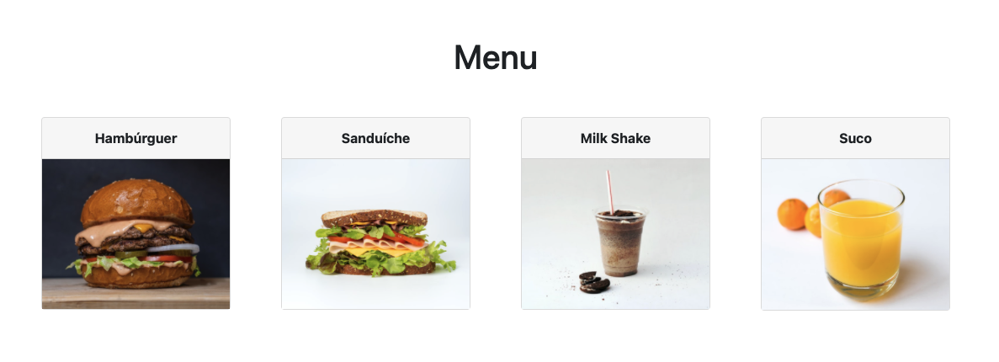

# Requisição Assíncrona

  - [Promise](#promise)
    - [Fulfilled](#fulfilled)
    - [Rejected](#rejected)
    - [Pending](#pending)
    - [Chaining](#chaining)
    - [Async & Await](#async--await)
  - [Fetch (Foods App)](#fetch-foods-app)

## Promise

---

### Fulfilled

```js
const condition = true;

const promise = new Promise((resolve, reject) => {
  if (condition)
    resolve('Valid promise');
  else
    reject('Invalid promise');
});

promise.then(r => console.log(r));
//=> Valid promise
```

### Rejected

```js
const condition = false;

const promise = new Promise((resolve, reject) => {
  if (condition)
    resolve('Valid promise');
  else
    reject('Invalid promise');
});

promise.then(r => console.log(r)).catch(r => console.log(r));
//=> Invalid promise
```

### Pending

```js
function sum(a, b) {
  return a + b;
}

function sumPromise(a, b) {
  const promise = new Promise((resolve, reject) => {
    if (isNaN(a) || isNaN(b))
      reject('Invalid numbers');
    else
      setTimeout(() => resolve(a + b), 200);
  });

  return promise
}

console.log(sum(1, 1));
console.log(sumPromise(2, 2));
sumPromise(2, 2)
  .then((res) => console.log(res))
  .catch((err) => console.log(err));
console.log(sum(3, 3));

//=>
// 2
// Promise { <pending> }
// 6
// 4
```

### Chaining

```js
function sumPromise(a, b) {
  const promise = new Promise((resolve, reject) => {
    if (isNaN(a) || isNaN(b))
      reject('Invalid numbers');
    else
      setTimeout(() => resolve(a + b), 200);
  });

  return promise
}

sumPromise(2, 2)
  .then((res) => sumPromise(res, 2))
  .then((res) => console.log(res))
  .catch((err) => console.log(err)); //=> 6
```

### Async & Await

```js
function sumPromise(a, b) {
  const promise = new Promise((resolve, reject) => {
    if (isNaN(a) || isNaN(b))
      reject('Invalid numbers');
    else
      setTimeout(() => resolve(a + b), 200);
  });

  return promise
}

async function sumAsync(a, b) {
  const sleep = (m) => new Promise(r => setTimeout(r, m))

  if (isNaN(a) || isNaN(b)) {
    throw new Error('Invalid numbers');
  } else {
    await sleep(200);
    return a + b;
  }
}

async function result() {
  try {
    const res = await sumPromise(2, 2);
    return await sumAsync(2, res);
  } catch (error) {
    if (error instanceof Error) {
      console.log(error.message);
    } else {
      console.log(err);
    }
  }
}

result().then((res) => console.log(res)); //=> 6
```


## Fetch (Foods App)

---

[](https://foods-read-fetch.lucachaves.repl.co/)

[Edit on Repl.it](https://replit.com/@lucachaves/foods-read-fetch?v=1)

```
foods-read-fetch
├── css
│   ├── bootstrap.min.css
│   └── style.css
├── imgs
│   ├── batatafrita.jpg
│   ├── hamburguer.jpg
│   ├── milkshake.jpg
│   ├── sanduiche.jpg
│   └── suco.jpg
├── index.html
└── js
    ├── lib
    │   ├── bootstrap.min.js
    │   ├── jquery.min.js
    │   └── popper.min.js
    ├── main.js
    └── model
        └── dataset.json
```

foods-read-fetch/index.html:
```html
<body>
  <div class="container">
    <h1 class="mt-5 text-center">Menu</h1>

    <section class="card-deck my-3"></section>
  <div>
  <script src="js/lib/jquery.min.js"></script>
  <script src="js/lib/popper.min.js"></script>
  <script src="js/lib/bootstrap.min.js"></script>
  <script src="js/main.js" type="module"></script>
</body>
```

foods-read-fetch/js/model/dataset.json:
```json
[
  {
    "id": 1,
    "name": "Hambúrguer",
    "image": "imgs/hamburguer.jpg"
  },
  {
    "id": 2,
    "name": "Sanduíche",
    "image": "imgs/sanduiche.jpg"
  },
  {
    "id": 3,
    "name": "Milk Shake",
    "image": "imgs/milkshake.jpg"
  },
  {
    "id": 4,
    "name": "Suco",
    "image": "imgs/suco.jpg"
  }
]
```

foods-read-fetch/js/main.js:
```js
async function loadFoods() {
  const response = await fetch('js/model/dataset.json');

  const foods = await response.json();

  for (const food of foods) {
    createFoodView(food);
  }
}

function createFoodView(food) {
  const foodsView = `
        <div class="card-food col-sm-6 col-lg-4 col-xl-3 mb-3" id="food-${food.id}">
          <div class="card">
            <div class="card-header text-center font-weight-bold">
              <span class="food-name">
                ${food.name}
              </span>
            </div>
            <div class="card-body p-0">
              
            </div>
          </div>
        </div>
      `;

  const foodsDeck = document.querySelector('.card-deck');

  foodsDeck.insertAdjacentHTML('beforeend', foodsView);
}

loadFoods();
```

> Se for executar o código localmente não esquece de habilitar o servidor usando ferramentas como o [Liver Server](https://marketplace.visualstudio.com/items?itemName=ritwickdey.LiveServer)
