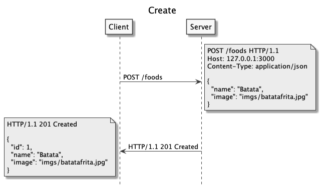
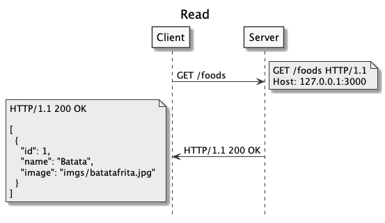
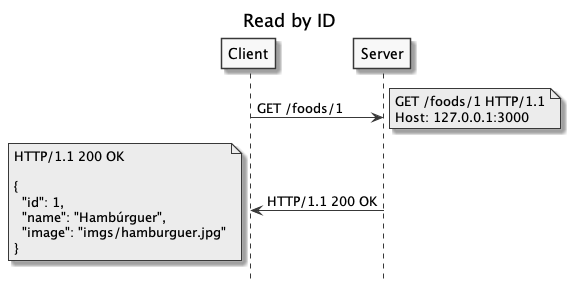
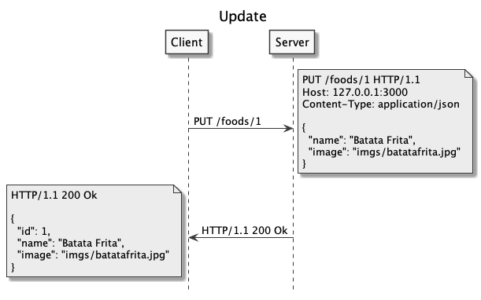
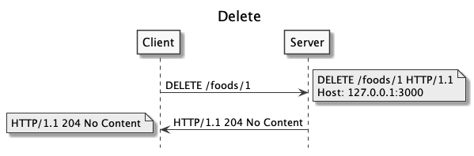

# REST API

  - [Web API](#web-api)
  - [Foods App (CRUD)](#foods-app-crud)
    - [Rotas do Foods API](#rotas-do-foods-api)
    - [HTTP Status Codes](#http-status-codes)
    - [Estrutura do Código](#estrutura-do-código)
    - [Create](#create)
    - [Read](#read)
    - [Update](#update)
    - [Delete](#delete)
  - [Front-end Web](#front-end-web)
    - [Estrutura do Código](#estrutura-do-código-1)
    - [Create](#create-1)
    - [Read](#read-1)
    - [Update](#update-1)
    - [Delete](#delete-1)

## Web API

---

- Exemplos
  - [ViaCEP](https://viacep.com.br/):
    - [https://viacep.com.br/ws/58015430/json/](https://viacep.com.br/ws/58015430/json/)
    - [Exemplo](https://ifpb.github.io/exercises/problems/web/app/address-cep-api/)
  - [Github Rest API](https://docs.github.com/en/rest)
    - [https://api.github.com/users/lucachaves](https://api.github.com/users/lucachaves)
    - [https://api.github.com/orgs/ifpb/repos](https://api.github.com/orgs/ifpb/repos)
    - [https://api.github.com/repos/ifpb/ls](https://api.github.com/repos/ifpb/ls)
    - [Exemplo](https://ifpb.github.io/challenges/web/front-end/js/github-profile-comparator/)
- Públicas
  - [public-apis/public-apis](https://github.com/public-apis/public-apis)
  - [TonnyL/Awesome_APIs](https://github.com/TonnyL/Awesome_APIs)
  - [public-api-lists/public-api-lists](https://github.com/public-api-lists/public-api-lists)
  - [n0shake/Public-APIs](https://github.com/n0shake/Public-APIs)

## Foods App (CRUD)

---

### Rotas do Foods API

| Método | Caminho              | Status       | Resposta                                     |
| ------ | -------------------- | ------------ | -------------------------------------------- |
| POST   | `/foods`             | `201`        | Cria uma nova comida                         |
| GET    | `/foods`             | `200`        | Retorna todas as comidas                     |
| GET    | `/foods?name=Batata` | `200`        | Retorna todas as comidas com o nome `Batata` |
| GET    | `/foods/1`           | `200`, `400` | Retorna a comida de ID 1                     |
| PUT    | `/foods/1`           | `200`, `400` | Atualiza a comida de ID 1                    |
| DELETE | `/foods/1`           | `204`, `400` | Exclui a comida de ID 1                      |

### HTTP Status Codes

- [Classes](https://developer.mozilla.org/en-US/docs/Web/HTTP/Status)
  - Respostas de informação (100-199)
  - Respostas de sucesso (200-299)
  - Redirecionamentos (300-399)
  - Erros do cliente (400-499)
  - Erros do servidor (500-599)
- Códigos do Foods API

| Código | Nome                  | Significado                                                                |
| ------ | --------------------- | -------------------------------------------------------------------------- |
| `200`  | Ok                    | Solicitação gerada com sucesso                                             |
| `201`  | Created               | Solicitação gerada com sucesso e um novo recurso foi criado como resultado |
| `204`  | No Content            | Solicitação gerada com sucesso e não há conteúdo para ser enviado          |
| `400`  | Bad Request           | Solicitação não compreendida por motivos de erro                           |
| `404`  | Not Found             | O servidor não pode encontrar o recurso solicitado                         |
| `500`  | Internal Server Error | O servidor encontrou uma situação com a qual não sabe lidar.               |

### Estrutura do Código

```
foods-json-server
├── package-lock.json
├── package.json
├── requests.http
└── index.js
```

```
$ npm install
$ npm run server
```

[Edit on Repl.it](https://replit.com/@lucachaves/foods-json-server#index.js)

### Create



requests.http:

```
### Create Food (Batata)

POST http://localhost:3000/foods
Content-Type: application/json

{
  "name": "Batata",
  "image": "imgs/batatafrita.jpg"
}
```

Repl.it: [Create (REQBIN)](https://reqbin.com/9waodvr5)

### Read



requests.http:

```
### Read Foods

GET http://localhost:3000/foods
```

Repl.it: [Read](https://foods-json-server.lucachaves.repl.co/foods)



requests.http:

```
### Read Food by ID

GET http://localhost:3000/foods/1
```

Repl.it: [Read by ID](https://foods-json-server.lucachaves.repl.co/foods/1)

### Update



requests.http:

```
### Update Food

PUT http://localhost:3000/foods/1
Content-Type: application/json

{
  "name": "Batata Frita",
  "image": "imgs/batatafrita.jpg"
}
```

Repl.it: [Update (REQBIN)](https://reqbin.com/8ypzzijf)

### Delete



requests.http:

```
### Delete Food

DELETE http://localhost:3000/foods/1
```

Repl.it: [Delete (REQBIN)](https://reqbin.com/lgvjhbmw)

## Front-end Web

---

### Estrutura do Código

```
foods-crud-fetch
├── css
│   ├── bootstrap.min.css
│   └── style.css
├── imgs
│   ├── batatafrita.jpg
│   ├── hamburguer.jpg
│   ├── milkshake.jpg
│   ├── sanduiche.jpg
│   └── suco.jpg
├── index.html
└── js
    ├── lib
    │   ├── bootstrap.min.js
    │   ├── jquery.min.js
    │   └── popper.min.js
    ├── main.js
    └── service
        └── api.js
```

[Edit on Repl.it](https://replit.com/@lucachaves/foods-crud-fetch#index.html)

js/services/api.js:

```js
const api = 'https://foods-json-server.lucachaves.repl.co';

async function create(food) {}
async function readAll() {}
async function readByName(name) {}
async function readById(id) {}
async function update(id, food) {}
async function remove(id) {}

export default { create, readAll, read, readByName, update, remove };
```

### Create

```js
async function create(food) {
  const res = await fetch(`${api}/foods`, {
    method: 'post',
    body: JSON.stringify(food),
    headers: {
      'Content-Type': 'application/json; charset=UTF-8',
    },
  });

  return await res.json();
}
```

```js
import api from './service/api.js';

const food = {
  "name": "Batata",
  "image": "imgs/batatafrita.jpg"
};

api.create(food);
```

### Read

js/services/api.js:

```js
async function readAll() {
  const res = await fetch(`${api}/foods`);

  return await res.json();
}

async function readByName(name) {
  const res = await fetch(`${api}/foods?name=${name}`);

  return await res.json();
}

async function readById(id) {
  const res = await fetch(`${api}/foods/${id}`);

  return await res.json();
}
```

```js
import api from './service/api.js';

api.readAll();
api.readByName('Batata');
api.readById(5);
```

### Update

js/services/api.js:

```js
async function update(id, food) {
  const res = await fetch(`${api}/foods/${id}`, {
    method: 'put',
    body: JSON.stringify(food),
    headers: {
      'Content-Type': 'application/json; charset=UTF-8',
    },
  });

  return await res.json();
}
```

```js
import api from './service/api.js';

const food = {
  "name": "Batata Frita",
  "image": "imgs/batatafrita.jpg"
};

api.upadte(5, food);
```

### Delete

js/services/api.js:

```js
async function remove(id) {
  await fetch(`${api}/foods/${id}`, {
    method: 'delete',
  });
}
```

```js
import api from './service/api.js';

api.remove(5);
```
